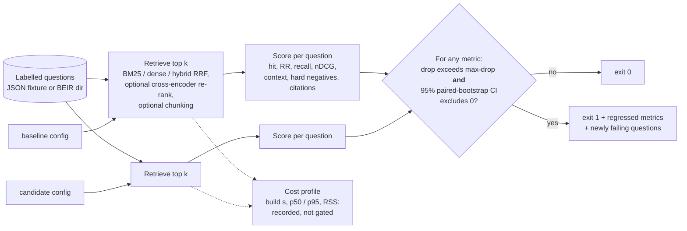

# rag-retrieval-gate: block retrieval regressions in CI

[](https://github.com/MatthewPaver/rag-retrieval-gate/actions/workflows/ci.yml)
[](LICENSE)

A regression gate for the retrieval half of a RAG system: it scores a baseline and a candidate retrieval configuration on the same labelled questions and exits non-zero when the candidate is significantly worse.

## Result: it blocks the bad change and lets the good ones through

BEIR SciFact (5,183 abstracts, 300 test queries), k=10. Each candidate is compared with BM25. Δ is candidate − baseline; the interval is a 95% paired bootstrap over queries (10,000 resamples, seed 0). The gate fails a metric only when the drop exceeds `--max-drop 0.02` **and** the interval excludes zero. Cost columns are recorded, not gated.

| Configuration | hit@10 | MRR@10 (Δ, 95% CI) | nDCG@10 (Δ, 95% CI) | Gate | Build s | p50 / p95 ms per query | Peak RSS MB | Model MB |
| --- | --- | --- | --- | --- | --- | --- | --- | --- |
| `baseline-bm25` | 0.8100 | 0.6321 | 0.6646 | baseline | 1.0 | 2.2 / 7.8 | 90 | - |
| `candidate-chunk-12` | 0.7300 | 0.5316 (−0.1005, [−0.1354, −0.0661]) | 0.5675 (−0.0971, [−0.1283, −0.0671]) | FAIL: hit_at_k, mrr_at_k, recall_at_k, ndcg_at_k, context_coverage_at_k | 1.1 | 6.5 / 20.7 | 170 | - |
| `candidate-minilm-l6` | 0.7933 | 0.6047 (−0.0274, [−0.0689, +0.0151]) | 0.6451 (−0.0195, [−0.0578, +0.0201]) | PASS | 83.8 | 8.9 / 13.7 | 684 | 91 |
| `candidate-hybrid-minilm` | 0.8267 | 0.6536 (+0.0215, [−0.0041, +0.0466]) | 0.6875 (+0.0229, [+0.0019, +0.0437]) | PASS (significantly better: ndcg_at_k) | 88.3 | 11.6 / 20.5 | 736 | 91 |
| `candidate-bm25-rerank-minilm` | 0.8167 | 0.6527 (+0.0206, [−0.0136, +0.0562]) | 0.6809 (+0.0163, [−0.0137, +0.0473]) | PASS | 5.8 | 1965.9 / 3923.8 | 954 | 91 |

Produced by:

```bash
python scripts/results_table.py --dataset data/beir/scifact --k 10 configs/baseline.json \
  configs/candidate-chunk-12.json configs/candidate-minilm.json \
  configs/candidate-hybrid-minilm.json configs/candidate-bm25-rerank.json
```

Each configuration runs in its own `rag-gate run` process, so peak RSS is that configuration's own (it includes the Python interpreter and, for model configs, PyTorch). Build time includes loading models from the local cache and embedding the corpus. Hardware: Apple M1 Pro, 8 cores, macOS (Darwin 27.0.0), Python 3.13.11, CPU only (`--device cpu`, the default).

What the table says:

- **12-word chunking is blocked.** It fails on five metrics, and every one of those intervals excludes zero. This is a real regression, not noise.
- **Hybrid BM25 + MiniLM passes and is the only significant improvement:** nDCG@10 +0.0229, interval [+0.0019, +0.0437]. Its MRR gain (+0.0215) is not significant at 300 queries. It costs a dense index (about 88 s to build on this CPU) and roughly 5× BM25's median query latency.
- **The cross-encoder re-ranker passes but does not earn its cost here.** Re-scoring BM25's top 100 with `cross-encoder/ms-marco-MiniLM-L-6-v2` raises MRR@10 by 0.0206 and nDCG@10 by 0.0163, but neither interval excludes zero ([−0.0136, +0.0562] and [−0.0137, +0.0473]). On this CPU it takes a median of 1,966 ms per query against BM25's 2.2 ms. On a GPU, or re-ranking fewer documents, the trade would look different; this table does not show that.
- **MiniLM on its own passes, and that needs reading carefully.** Under the old threshold-only rule its MRR drop of 0.0274 failed the gate. With 300 queries that drop is inside the noise (interval [−0.0689, +0.0151]), so the gate no longer blocks it. Passing means "not shown to be worse", not "better": the point estimates are all negative.

No parameter was tuned on the test queries. RRF uses k=60 from Cormack, Clarke and Büttcher (2009) and fuses each retriever's top 100; the re-ranker re-scores BM25's top 100, as in the BEIR paper. All of these are config defaults fixed before the first SciFact run.

To try it on the committed fixture (Python 3.11+): `pip install -e .`, then `rag-gate gate --dataset fixtures/policies.json --k 3 --baseline configs/baseline.json --candidate configs/candidate-chunk-12.json`. The full [Quickstart](#quickstart) is below.

## The problem

Teams change the retrieval layer of a RAG system all the time: a new embedding model, a different chunk size, a hybrid retriever, a re-ranker. Each change is usually judged by eye on a handful of queries. The failure that matters is quiet: the right passage drops from rank 2 to rank 12, falls out of the context window, and the generator either answers from something else or cites a source it was never shown.

This tool asks two questions of every change, on the same labelled questions, before it merges:

1. **Does it still retrieve the right evidence?** hit@k, MRR@k, recall@k, nDCG@k, plus required-context coverage and hard-negative-at-rank-1 for questions that label them.
2. **Would the answer's citations still hold?** For questions that carry a reference answer with `[doc-id]` citations, every cited document must be in the retrieved top k and labelled as evidence.

## How it works



A configuration is a small JSON file:

```json
{"name": "candidate-chunk-12", "retriever": "bm25", "chunk_words": 12, "chunk_overlap": 4}
{"name": "candidate-minilm-l6", "retriever": "dense", "model": "sentence-transformers/all-MiniLM-L6-v2"}
{"name": "candidate-hybrid-minilm", "retriever": "hybrid", "model": "sentence-transformers/all-MiniLM-L6-v2", "rrf_k": 60, "fusion_depth": 100}
{"name": "candidate-bm25-rerank-minilm", "retriever": "bm25", "rerank_model": "cross-encoder/ms-marco-MiniLM-L-6-v2", "rerank_depth": 100}
```

`retriever` is `bm25` (pure-Python Okapi BM25, tunable `bm25_k1` / `bm25_b`), `dense` (any sentence-transformers model, cosine over normalised embeddings) or `hybrid` (both, merged by reciprocal rank fusion: each document scores the sum of 1 / (`rrf_k` + rank) over the two top-`fusion_depth` lists). `rerank_model` adds a cross-encoder that re-scores the first stage's top `rerank_depth` documents against the full document text. `chunk_words` splits documents into overlapping word windows; results are collapsed back to unique document IDs at each document's best-ranked chunk, so metrics are always about documents.

### When does the gate fail?

For each metric the gate pairs the two runs question by question, resamples questions with replacement 10,000 times (seed 0) and takes the 95% percentile interval of candidate − baseline. A metric fails only if both hold:

1. the observed drop is larger than `--max-drop` (default 0.02, absolute): the smallest change worth blocking a merge for; and
2. the interval excludes zero on the worse side (`--alpha 0.05`): the drop is unlikely to be noise from which questions happen to be in the set.

Verdicts are `FAIL`, `not significant` (worse, but the interval includes zero), `within max-drop` (significantly worse, but by less than the threshold), `better` (significantly better) or `ok`. `--resamples`, `--seed` and `--alpha` are flags. `--no-bootstrap` restores threshold-only gating; use it on very small fixtures, where a bootstrap has no power.

Every run also records index build time, p50 / p95 per-query latency (queries are timed one at a time), peak resident memory, model parameter count and weight size, and the hardware. These are reported next to quality and are not gated.

Code layout:

| Path | Role |
| --- | --- |
| `src/rag_gate/data.py` | Loads and validates the JSON fixture format and BEIR directories |
| `src/rag_gate/retrievers.py` | BM25, dense, hybrid (RRF) and cross-encoder re-ranking, chunking |
| `src/rag_gate/metrics.py` | Per-question scoring and aggregation, all cut off at k |
| `src/rag_gate/stats.py` | Paired bootstrap confidence intervals for candidate − baseline |
| `src/rag_gate/gate.py` | `run` one config (quality and cost); `compare` two runs with threshold and significance |
| `src/rag_gate/cli.py` | `rag-gate run`, `rag-gate compare`, `rag-gate gate` |
| `fixtures/policies.json` | 11-document, 6-question fixture committed for offline tests and CI |
| `scripts/fetch_beir.py` | Downloads BEIR SciFact locally with checksum and licence gating |
| `scripts/results_table.py` | Runs each config in its own process and prints the results table above |

## Quickstart

```bash
# Python 3.11+
python -m venv .venv && source .venv/bin/activate
pip install -e ".[dev]"
python -m pytest -q

# Offline gate on the committed fixture
rag-gate gate --dataset fixtures/policies.json --k 3 \
  --baseline configs/baseline.json --candidate configs/candidate-chunk-12.json
```

Exit codes: `0` pass, `1` the candidate is significantly worse by more than `--max-drop` (default `0.02`, absolute) on at least one metric, `2` bad input or usage.

To score each configuration separately, keep the full per-question reports and compare them:

```bash
rag-gate run --dataset fixtures/policies.json --k 3 --config configs/baseline.json --output reports/baseline.json
rag-gate run --dataset fixtures/policies.json --k 3 --config configs/candidate-chunk-12.json --output reports/candidate.json
rag-gate compare reports/baseline.json reports/candidate.json --max-drop 0.02
```

### Public benchmark: BEIR SciFact

SciFact (5,183 abstracts, 300 test claims with relevance labels) is downloaded, not committed:

```bash
python scripts/fetch_beir.py --acknowledge-licence
# If the UKP host is unreachable, use the pinned Hugging Face mirror (needs pyarrow):
python scripts/fetch_beir.py --acknowledge-licence --source huggingface

pip install -e ".[dense]"   # only for dense, hybrid and re-rank configs
rag-gate gate --dataset data/beir/scifact --k 10 \
  --baseline configs/baseline.json --candidate configs/candidate-hybrid-minilm.json
```

Dense, hybrid and re-rank configs load models from the local Hugging Face cache only. Pass `--allow-download` to let them fetch a model.

## Example output

The committed fixture, comparing whole-document BM25 with the same retriever over 12-word chunks. With six questions the bootstrap cannot separate a one-question change from noise, so the default gate passes it:

```text
$ rag-gate gate --dataset fixtures/policies.json --k 3 --baseline configs/baseline.json --candidate configs/candidate-chunk-12.json
dataset=policies documents=11 cases=6 k=3 max_drop=0.02 bootstrap=10000 seed=0 alpha=0.05
metric                                 baseline-bm25    candidate-chunk-12     delta                95% CI  verdict
hit_at_k                                      1.0000                1.0000   +0.0000    [+0.0000, +0.0000]  ok
mrr_at_k                                      0.9167                0.8333   -0.0834    [-0.2500, +0.0000]  not significant
recall_at_k                                   1.0000                1.0000   +0.0000    [+0.0000, +0.0000]  ok
ndcg_at_k                                     0.9385                0.8770   -0.0615    [-0.1845, +0.0000]  not significant
...
gate: PASS
```

That is why CI gates the fixture with `--no-bootstrap`: there it is a tripwire, and the same comparison fails on `mrr_at_k` and `ndcg_at_k` with exit `1`. The per-question report (`--output`) shows why MRR fell: for the data-retention question, chunking ranked a superseded 2022 proposal above the approved rule. Both are still in the top 3, so the citations hold, but the generator now sees the wrong rule first.

On SciFact the same chunking change fails with every interval well below zero (see the results table). BEIR has no reference answers, so citation metrics are reported only for the fixture.

## The gate in CI

This repository's own workflow ([`.github/workflows/ci.yml`](.github/workflows/ci.yml)) lints and type-checks the code, runs the tests, gates a candidate config on the fixture, and checks that a known regression still exits `1` (threshold-only, as above). It stays offline: no models, no SciFact. In a product repository the step looks like this:

```yaml
- name: Retrieval regression gate
  run: |
    pip install "rag-retrieval-gate @ git+https://github.com/MatthewPaver/rag-retrieval-gate@v0.1.1"
    rag-gate gate \
      --dataset eval/questions.json --k 5 \
      --baseline eval/retrieval-main.json \
      --candidate eval/retrieval-this-pr.json \
      --max-drop 0.02 --output reports/retrieval-gate.json
- uses: actions/upload-artifact@v4
  if: always()
  with:
    name: retrieval-gate
    path: reports/retrieval-gate.json
```

Keep the baseline config pinned to what is in production; the pull request edits only the candidate.

## Writing your own questions

```json
{
  "corpus": [{"id": "refund-current", "text": "Refund requests are accepted within 30 days of delivery."}],
  "cases": [{
    "id": "refund-window",
    "query": "How long do customers have to request a refund?",
    "relevant_ids": ["refund-current"],
    "required_context_ids": ["refund-current"],
    "hard_negative_ids": [],
    "answer": "Customers have 30 days from delivery [refund-current]."
  }]
}
```

The loader rejects duplicate IDs, blank text, unknown document IDs, cases without relevant documents, hard negatives that overlap the evidence, and answers that cite nothing or cite documents not in the corpus. Any of these exits `2` with a message saying what is wrong and where.

## Design decisions and trade-offs

- **Documents, not chunks, are the unit of truth.** Labels are written against stable document IDs so that a chunking change can be compared with the previous chunking. The cost: the gate cannot tell you which chunk carried the answer.
- **Absolute threshold plus a significance test.** One `--max-drop` for all metrics is blunt but easy to reason about in review. On its own it fails changes on noise: MiniLM's 0.0274 MRR drop on 300 queries would block a merge although the interval runs from −0.0689 to +0.0151. Requiring the paired bootstrap interval to exclude zero fixes that. The cost is power: on small question sets real regressions pass as "not significant", so the fixture runs threshold-only.
- **The gate blocks regressions; it does not demand improvements.** A candidate passes when it is not shown to be worse. If a change must prove it is better before it ships, read the `better` verdicts, or run with a larger question set.
- **Fixed, untuned fusion and re-rank depths.** RRF k=60 and depth 100 are literature defaults, chosen before any SciFact run. Tuning them on the 300 test queries would make the hybrid row look better and mean less.
- **Cost is measured, not gated.** Latency and memory depend on the machine running CI, so a fixed threshold would be flaky across runners. The numbers sit beside quality so a reviewer can weigh them.
- **Citation checks use reference answers, not generated ones.** The gate checks whether evidence a correct answer needs would reach the context window under the candidate config. It does not run a generator or an LLM judge, so it is deterministic and free to run on every pull request.
- **No dependencies for the core path.** BM25, loading and scoring are standard library only; numpy and sentence-transformers are optional extras. CI installs in seconds and runs offline.
- **Models never download silently.** Dense retrieval reads the local cache unless `--allow-download` is passed, so a CI run cannot change model weights underneath you.
- **Public data is fetched, verified and left out of Git.** The fetcher checks an MD5 (UKP zip) or pinned SHA-256s (Hugging Face mirror) and refuses to run without a licence acknowledgement.

## Limits

- Passing the gate says the labelled evidence was retrieved. It does not say an answer is true, or that a generator would use the evidence well.
- Citation checks match identifiers. A cited document can be present and still not entail the sentence that cites it.
- The committed fixture is 11 documents and 6 questions, written to exercise superseded rules and near-miss distractors. It is a test fixture, not a benchmark. Results on your corpus need your questions.
- SciFact is one domain. A model that loses on SciFact may win on yours; run the gate on your own labelled set before deciding.
- Dense retrieval is brute-force cosine over all chunks in memory. That is fine at SciFact scale (5,183 abstracts) and not intended for production-scale indexes; the gate measures configurations, it does not serve them.
- Latency figures come from one laptop CPU, one query at a time, with no batching, quantisation or GPU. They rank configurations against each other; they are not a serving benchmark. BM25 here is pure Python, so a production BM25 engine would be faster still.
- Peak memory is the process's resident peak. In `rag-gate gate` both configs run in one process, so the candidate's figure includes the baseline's; `scripts/results_table.py` runs each config separately.
- The bootstrap treats the questions as a sample from the questions you care about. If the labelled set is unrepresentative, the interval is precise about the wrong thing.
- Access control and per-call API pricing are out of scope.

## Licence

MIT. See [LICENSE](LICENSE).
