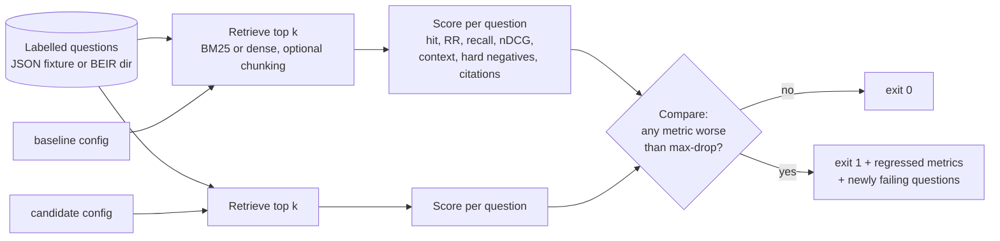

# rag-retrieval-gate

[](https://github.com/MatthewPaver/rag-retrieval-gate/actions/workflows/ci.yml)
[](LICENSE)

A regression gate for the retrieval half of a RAG system. Point it at a set of labelled questions, a baseline retrieval configuration and a candidate one. It scores both, prints the difference and exits non-zero if the candidate is worse than the baseline by more than a threshold you set. That makes it a CI step.

## The problem

Teams change the retrieval layer of a RAG system all the time: a new embedding model, a different chunk size, a hybrid retriever, a re-ranker. Each change is usually judged by eye on a handful of queries. The failure that matters is quiet: the right passage drops from rank 2 to rank 12, falls out of the context window, and the generator either answers from something else or cites a source it was never shown.

This tool asks two questions of every change, on the same labelled questions, before it merges:

1. **Does it still retrieve the right evidence?** hit@k, MRR@k, recall@k, nDCG@k, plus required-context coverage and hard-negative-at-rank-1 for questions that label them.
2. **Would the answer's citations still hold?** For questions that carry a reference answer with `[doc-id]` citations, every cited document must be in the retrieved top k and labelled as evidence.

## How it works



A configuration is a small JSON file:

```json
{"name": "candidate-chunk-12", "retriever": "bm25", "chunk_words": 12, "chunk_overlap": 4}
{"name": "candidate-minilm-l6", "retriever": "dense", "model": "sentence-transformers/all-MiniLM-L6-v2"}
```

`retriever` is `bm25` (pure-Python Okapi BM25, tunable `bm25_k1` / `bm25_b`) or `dense` (any sentence-transformers model, cosine over normalised embeddings). `chunk_words` splits documents into overlapping word windows; results are collapsed back to unique document IDs at each document's best-ranked chunk, so metrics are always about documents.

Code layout:

| Path | Role |
| --- | --- |
| `src/rag_gate/data.py` | Loads and validates the JSON fixture format and BEIR directories |
| `src/rag_gate/retrievers.py` | BM25, dense retrieval, chunking |
| `src/rag_gate/metrics.py` | Per-question scoring and aggregation, all cut off at k |
| `src/rag_gate/gate.py` | `run` one config; `compare` two runs against a threshold |
| `src/rag_gate/cli.py` | `rag-gate run`, `rag-gate compare`, `rag-gate gate` |
| `fixtures/policies.json` | 11-document, 6-question fixture committed for offline tests and CI |
| `scripts/fetch_beir.py` | Downloads BEIR SciFact locally with checksum and licence gating |

## Quickstart

```bash
python -m venv .venv && source .venv/bin/activate
pip install -e ".[dev]"
python -m pytest -q

# Offline gate on the committed fixture
rag-gate gate --dataset fixtures/policies.json --k 3 \
  --baseline configs/baseline.json --candidate configs/candidate-chunk-12.json
```

Exit codes: `0` pass, `1` the candidate regressed beyond `--max-drop` (default `0.02`, absolute), `2` bad input or usage.

To score one configuration and keep the full per-question report:

```bash
rag-gate run --dataset fixtures/policies.json --k 3 --config configs/baseline.json --output reports/baseline.json
rag-gate compare reports/baseline.json reports/candidate.json --max-drop 0.02
```

### Public benchmark: BEIR SciFact

SciFact (5,183 abstracts, 300 test claims with relevance labels) is downloaded, not committed:

```bash
python scripts/fetch_beir.py --acknowledge-licence
# If the UKP host is unreachable, use the pinned Hugging Face mirror (needs pyarrow):
python scripts/fetch_beir.py --acknowledge-licence --source huggingface

pip install -e ".[dense]"   # only for dense configs
rag-gate gate --dataset data/beir/scifact --k 10 \
  --baseline configs/baseline.json --candidate configs/candidate-minilm.json
```

Dense configs load models from the local Hugging Face cache only. Pass `--allow-download` to let them fetch a model.

## Example output

The committed fixture, comparing whole-document BM25 with the same retriever over 12-word chunks:

```text
$ rag-gate gate --dataset fixtures/policies.json --k 3 --baseline configs/baseline.json --candidate configs/candidate-chunk-12.json
dataset=policies documents=11 cases=6 k=3 max_drop=0.02
metric                                 baseline-bm25    candidate-chunk-12     delta
hit_at_k                                      1.0000                1.0000   +0.0000
mrr_at_k                                      0.9167                0.8333   -0.0834  FAIL
recall_at_k                                   1.0000                1.0000   +0.0000
ndcg_at_k                                     0.9385                0.8770   -0.0615  FAIL
context_coverage_at_k                         1.0000                1.0000   +0.0000
citation_precision                            1.0000                1.0000   +0.0000
answers_fully_supported_rate                  1.0000                1.0000   +0.0000
hard_negative_top1_rate                       0.0000                0.0000   +0.0000
gate: FAIL: mrr_at_k, ndcg_at_k
```

Hit rate is unchanged, so a spot check would pass. The per-question report (`--output`) shows why MRR fell: for the data-retention question, chunking ranked a superseded 2022 proposal above the approved rule. Both are still in the top 3, so the citations hold, but the generator now sees the wrong rule first.

SciFact, k=10, all 300 test queries. Each row is produced by `rag-gate gate --dataset data/beir/scifact --k 10 --baseline configs/baseline.json --candidate <config>`:

| Configuration | hit@10 | MRR@10 | recall@10 | nDCG@10 | Gate vs BM25 (max-drop 0.02) |
| --- | --- | --- | --- | --- | --- |
| `baseline.json` (BM25, whole abstracts) | 0.8100 | 0.6321 | 0.7883 | 0.6646 | n/a |
| `candidate-minilm.json` (all-MiniLM-L6-v2) | 0.7933 | 0.6047 | 0.7833 | 0.6451 | FAIL: mrr_at_k |
| `candidate-chunk-12.json` (BM25, 12-word chunks) | 0.7300 | 0.5316 | 0.7100 | 0.5675 | FAIL: all five |

A general-purpose small embedding model is not automatically better than BM25 on scientific claims, which is exactly the kind of assumption the gate exists to test. BEIR has no reference answers, so citation metrics are reported only for the fixture.

## The gate in CI

This repository's own workflow ([`.github/workflows/ci.yml`](.github/workflows/ci.yml)) runs the tests, gates a candidate config on the fixture, and checks that a known regression still exits `1`. In a product repository the step looks like this:

```yaml
- name: Retrieval regression gate
  run: |
    pip install "rag-retrieval-gate @ git+https://github.com/MatthewPaver/rag-retrieval-gate"
    rag-gate gate \
      --dataset eval/questions.json --k 5 \
      --baseline eval/retrieval-main.json \
      --candidate eval/retrieval-this-pr.json \
      --max-drop 0.02 --output reports/retrieval-gate.json
- uses: actions/upload-artifact@v4
  if: always()
  with:
    name: retrieval-gate
    path: reports/retrieval-gate.json
```

Keep the baseline config pinned to what is in production; the pull request edits only the candidate.

## Writing your own questions

```json
{
  "corpus": [{"id": "refund-current", "text": "Refund requests are accepted within 30 days of delivery."}],
  "cases": [{
    "id": "refund-window",
    "query": "How long do customers have to request a refund?",
    "relevant_ids": ["refund-current"],
    "required_context_ids": ["refund-current"],
    "hard_negative_ids": [],
    "answer": "Customers have 30 days from delivery [refund-current]."
  }]
}
```

The loader rejects duplicate IDs, blank text, unknown document IDs, cases without relevant documents, hard negatives that overlap the evidence, and answers that cite nothing or cite documents not in the corpus. Any of these exits `2` with a message saying what is wrong and where.

## Design decisions and trade-offs

- **Documents, not chunks, are the unit of truth.** Labels are written against stable document IDs so that a chunking change can be compared with the previous chunking. The cost: the gate cannot tell you which chunk carried the answer.
- **Absolute threshold on every metric.** One `--max-drop` for all metrics is blunt but easy to reason about in review. On a six-question fixture one question moves MRR by more than 0.08, so the fixture is a tripwire for ranking changes, not a precise measure.
- **Citation checks use reference answers, not generated ones.** The gate checks whether evidence a correct answer needs would reach the context window under the candidate config. It does not run a generator or an LLM judge, so it is deterministic and free to run on every pull request.
- **No dependencies for the core path.** BM25, loading and scoring are standard library only; numpy and sentence-transformers are optional extras. CI installs in seconds and runs offline.
- **Models never download silently.** Dense retrieval reads the local cache unless `--allow-download` is passed, so a CI run cannot change model weights underneath you.
- **Public data is fetched, verified and left out of Git.** The fetcher checks an MD5 (UKP zip) or pinned SHA-256s (Hugging Face mirror) and refuses to run without a licence acknowledgement.

## Limits

- Passing the gate says the labelled evidence was retrieved. It does not say an answer is true, or that a generator would use the evidence well.
- Citation checks match identifiers. A cited document can be present and still not entail the sentence that cites it.
- The committed fixture is 11 documents and 6 questions, written to exercise superseded rules and near-miss distractors. It is a test fixture, not a benchmark. Results on your corpus need your questions.
- SciFact is one domain. A model that loses on SciFact may win on yours; run the gate on your own labelled set before deciding.
- Dense retrieval is brute-force cosine over all chunks in memory. That is fine at SciFact scale (5,183 abstracts) and not intended for production-scale indexes; the gate measures configurations, it does not serve them.
- Latency, cost and access control are out of scope.

## Licence

MIT. See [LICENSE](LICENSE).
